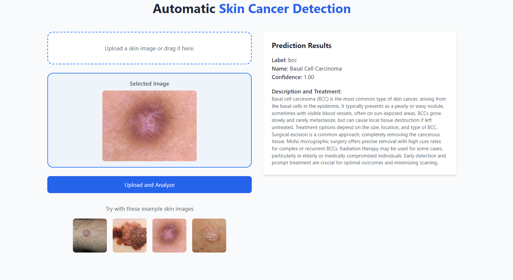

# Automatic Skin Cancer Detection App 🌟

This project is a web-based application for **automatic skin cancer detection**. It uses a pre-trained `tflite` model to classify skin images and provides descriptions and treatments for detected conditions using Google Generative AI.

---

## 📌 Features
- Upload a skin image or select from pre-existing examples.
- Image classification using a TensorFlow Lite model.
- Retrieves description and treatment suggestions for predicted diseases using Google Generative AI.
- Beautiful, responsive UI built with **HTML, TailwindCSS, and JavaScript**.
- Backend powered by **Flask**.

## Application Screenshot

## 🔗 Live Demo
[Live Demo](https://skin-cancer-classifier-ksrh.onrender.com)

