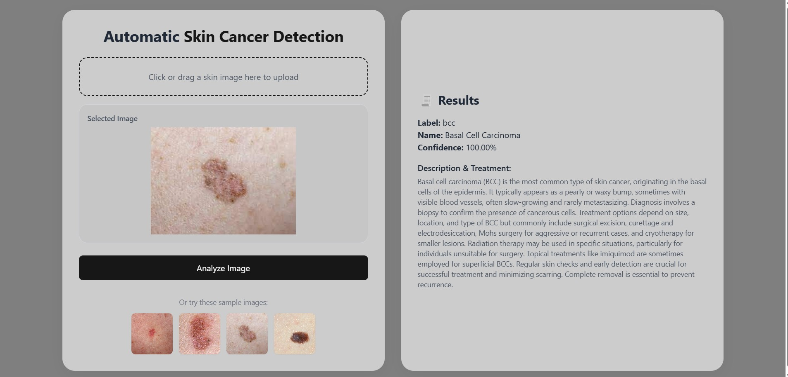

# Automatic Skin Cancer Detection App

This project is a web-based application designed for **automatic skin cancer detection**. Leveraging machine learning and generative AI, the application classifies uploaded skin images and provides users with relevant information and treatment options based on the classification. The system combines the speed of a lightweight on-device model with the intelligence of AI-powered medical content generation.

---

## Table of Contents

- [Features](#features)  
- [Technology Stack](#technology-stack)  
- [How It Works](#how-it-works)  
- [Getting Started](#getting-started)  
- [Application Screenshot](#application-screenshot)  
- [Live Demo](#live-demo)  
- [Limitations and Disclaimer](#limitations-and-disclaimer)  
- [License](#license)

---

## Features

- Upload a skin image or choose from pre-defined example images.
- Automatically classifies the image using a **TensorFlow Lite** (`.tflite`) machine learning model.
- Utilizes **Google Generative AI** to fetch a description and possible treatment suggestions for the identified condition.
- Built with a responsive and modern user interface using **HTML**, **TailwindCSS**, and **JavaScript**.
- Lightweight and scalable backend developed using **Flask**.
- Deployed and accessible via a publicly hosted link.

---

## Technology Stack

**Frontend:**
- HTML5
- TailwindCSS
- JavaScript

**Backend:**
- Python
- Flask
- TensorFlow Lite (TFLite)
- Google Generative AI API

**Deployment:**
- Hosted on Render

---

## How It Works

1. **Image Input:**  
   The user uploads a skin image via the web interface.

2. **Image Classification:**  
   The image is passed to a pre-trained TensorFlow Lite model which predicts the possible type of skin disease.

3. **AI Description & Treatment Generation:**  
   Based on the prediction, a prompt is sent to the Google Generative AI API to retrieve a brief description and treatment suggestions.

4. **Result Presentation:**  
   The prediction result, along with the AI-generated information, is displayed in a user-friendly format.

---

## Getting Started

To run this project locally, follow the steps below:

### Prerequisites
- Python 3.8+
- pip (Python package manager)
- A valid API key for Google Generative AI (if using live AI responses)

### Installation

```bash
git clone https://github.com/yourusername/skin-cancer-detector.git
cd skin-cancer-detector
pip install -r requirements.txt
```

### Running the Application

```bash
python app.py
```

Visit `http://localhost:5000` in your browser to access the app.

---

## Application Screenshot

<<<<<<< HEAD

=======

>>>>>>> 2b9b1909 (Resolve merge conflict)

---

## Live Demo

You can try the deployed version here:  
[https://skin-cancer-classifier-ksrh.onrender.com](https://skin-cancer-classifier-ksrh.onrender.com)

---

## Limitations and Disclaimer

- This tool is intended for **educational and research purposes only** and **is not a substitute for professional medical advice**.
- The accuracy of the model is dependent on the dataset used for training, and predictions should not be solely relied upon for diagnosis.
- Always consult a licensed medical professional for any concerns regarding skin health.

---

## License

This project is open-source and available under the [MIT License](LICENSE).

<<<<<<< HEAD
---
=======
---
>>>>>>> 2b9b1909 (Resolve merge conflict)
